<p align="center">
  <h1 align="center">🔬 EndoDINOv2 — Endoscopy Classification & Polyp Segmentation</h1>
  <p align="center">
    Self-supervised transfer learning with DINOv2 for gastrointestinal endoscopy analysis
  </p>
</p>

---

## Overview

**EndoDINOv2** is a two-stage deep learning pipeline for gastrointestinal endoscopy image and video analysis. It combines:

1. **Classification** — A DINOv2 ViT-S/14 backbone fine-tuned on endoscopy images to classify frames into **23 GI conditions**.
2. **Segmentation** — A UNet trained from scratch for **binary polyp segmentation**, triggered automatically when a polyp is detected.
3. **Explainability** — GradCAM attention heatmaps overlaid on the input to show which regions drive the classifier's decision.
4. **LLM Report Generation** — Structured findings are sent to a local LLM (via [LM Studio](https://lmstudio.ai/)) to generate a human-readable medical report.

All inference modes are served through interactive **Gradio** web interfaces.

---

## Architecture

```
Input (Image / Video)
        │
        ▼
┌──────────────────────┐
│  DINOv2 ViT-S/14     │  ← Self-supervised backbone (facebookresearch/dinov2)
│  (Transfer Learned)   │  ← Fine-tuned on endoscopy images
│  + Linear Head (384→23)│
└──────────┬───────────┘
           │
     Classification
     (23 GI classes)
           │
           ├──── GradCAM Heatmap Overlay
           │
           ▼
    Is prediction "polyps"?
      │            │
     YES          NO
      │            │
      ▼            ▼
┌──────────┐    Return classification
│   UNet   │    + heatmap only
│ (320×320)│
└────┬─────┘
     │
     ▼
  Binary Polyp
  Segmentation Mask
     │
     ▼
  Contour Overlay
     │
     ▼
┌──────────────────┐
│  LM Studio LLM   │  ← Generates medical report from JSON findings
└──────────────────┘
```

---

## Supported Classes (23)

| # | Class | # | Class |
|---|-------|---|-------|
| 0 | `barretts` | 12 | `polyps` |
| 1 | `barretts-short-segment` | 13 | `pylorus` |
| 2 | `bbps-0-1` | 14 | `retroflex-rectum` |
| 3 | `bbps-2-3` | 15 | `retroflex-stomach` |
| 4 | `cecum` | 16 | `ulcerative-colitis-grade-0-1` |
| 5 | `dyed-lifted-polyps` | 17 | `ulcerative-colitis-grade-1` |
| 6 | `dyed-resection-margins` | 18 | `ulcerative-colitis-grade-1-2` |
| 7 | `esophagitis-a` | 19 | `ulcerative-colitis-grade-2` |
| 8 | `esophagitis-b-d` | 20 | `ulcerative-colitis-grade-2-3` |
| 9 | `hemorrhoids` | 21 | `ulcerative-colitis-grade-3` |
| 10 | `ileum` | 22 | `z-line` |
| 11 | `impacted-stool` | | |

---

## Project Structure

```
EndoDINOv2-cls-seg/
│
├── inference.py                  # Image-only inference (Gradio GUI)
├── inference_v2.py               # Video-only inference (Gradio GUI)
├── inference_v3.py               # Image + Video inference (Gradio GUI)
│
├── Transfer_learned_final.pth    # Classification model weights (DINOv2 + linear head)
├── unet_baseline_best_Final.pth  # Segmentation model weights (UNet)
│
├── lmstudio_report.py            # LLM report generation via LM Studio API
├── prompter.py                   # Prompt builder for LLM medical reports
│
├── test.py                       # Evaluation script (classification + segmentation metrics)
├── polyp_bbox/                   # Test images for polyp evaluation
│   └── img/                      # Polyp images
│
├── Testing/                      # Extended testing & metrics utilities
│   ├── run.py                    # Full evaluation loop with DataLoader
│   ├── test.py                   # Model evaluation with classification + segmentation
│   ├── classs.py                 # Classification metrics (accuracy, precision, recall, F1)
│   └── compute.py                # Segmentation metrics (IoU, precision, recall, F1)
│
└── Readme.md                     # This file
```

---

## Model Details

### Classification Model (`Transfer_learned_final.pth`)

| Property | Value |
|----------|-------|
| **Backbone** | DINOv2 ViT-S/14 (`dinov2_vits14`) |
| **Training strategy** | Self-supervised pre-training → Transfer learning on labelled endoscopy images |
| **Head** | Linear layer (384 → 23 classes) |
| **Input size** | 224 × 224 |
| **Normalization** | ImageNet mean/std (`[0.485, 0.456, 0.406]` / `[0.229, 0.224, 0.225]`) |
| **Explainability** | ViT GradCAM on the backbone's LayerNorm output |

The checkpoint stores `backbone_state_dict` and `head_state_dict` separately.

### Segmentation Model (`unet_baseline_best_Final.pth`)

| Property | Value |
|----------|-------|
| **Architecture** | UNet (encoder: 64→128→256→512→1024 bottleneck) |
| **Training strategy** | Trained from scratch on polyp segmentation masks |
| **Task** | Binary segmentation (polyp vs. background) |
| **Input size** | 320 × 320 |
| **Output** | Single-channel sigmoid mask, thresholded at 0.5 |

---

## Inference Modes

### `inference.py` — Image Only

Accepts a single endoscopy image and returns:
- **GradCAM heatmap overlay** with predicted class and confidence
- **Polyp segmentation overlay** (contour drawn on image, only if `polyps` is predicted)
- **JSON findings** (predicted class, confidence, polyp detection status)
- **LLM medical report** generated via LM Studio

```bash
python inference.py
# Opens Gradio GUI at http://localhost:7860
```

### `inference_v2.py` — Video Only

Processes endoscopy videos frame-by-frame with:
- **Temporal smoothing** (exponential moving average, α=0.3) for stable predictions across frames
- **Per-frame GradCAM heatmaps** compiled into an output video
- **Per-frame segmentation overlays** compiled into a second video (for polyp frames)
- **Aggregated JSON findings** across all frames

```bash
python inference_v2.py
# Opens Gradio GUI at http://localhost:7860
```

### `inference_v3.py` — Image + Video (Combined)

Unified interface that accepts **either** an image or a video file and automatically routes to the appropriate pipeline:
- Detects file type by extension (`.mp4`, `.avi`, `.mov` → video; everything else → image)
- Combines all outputs from both image and video pipelines into a single interface

```bash
python inference_v3.py
# Opens Gradio GUI at http://localhost:7860
```

---

## Installation

### Prerequisites

- Python 3.8+
- PyTorch (with CUDA support recommended)
- A running [LM Studio](https://lmstudio.ai/) instance for report generation (optional)

### Setup

```bash
# Clone the repository
git clone https://github.com/Alentito/EndoDinov2-cls-seg.git
cd EndoDinov2-cls-seg

# Create and activate virtual environment
python -m venv .venv
source .venv/bin/activate

# Install dependencies
pip install torch torchvision numpy opencv-python gradio matplotlib scikit-learn requests
```

### Model Weights

Place the following weight files in the project root:

| File | Description |
|------|-------------|
| `Transfer_learned_final.pth` | DINOv2 classification checkpoint |
| `unet_baseline_best_Final.pth` | UNet segmentation checkpoint |

> **Note:** The DINOv2 backbone weights are automatically downloaded from `facebookresearch/dinov2` via `torch.hub` on first run. The checkpoint files above contain only the **fine-tuned** backbone and head weights.

---

## Usage

### Quick Start (Image Inference)

```bash
source .venv/bin/activate
python inference.py
```

This launches a Gradio web interface. Drop an endoscopy image to get:
1. Classification with GradCAM attention heatmap
2. Polyp segmentation (if polyps detected)
3. Structured JSON findings
4. LLM-generated medical report

### Video Inference

```bash
python inference_v2.py
```

Upload an endoscopy video to get frame-by-frame analysis with temporally smoothed predictions.

### Combined Image + Video

```bash
python inference_v3.py
```

Upload either an image or video — the system auto-detects the format.

---

## LLM Report Generation (Optional)

The pipeline can generate natural language medical reports from the structured classification/segmentation findings using a local LLM via [LM Studio](https://lmstudio.ai/).

### Setup

1. Download and install [LM Studio](https://lmstudio.ai/)
2. Load a model (e.g., a medical or general-purpose LLM)
3. Start the local server (default: `http://localhost:1234`)

The report generator (`lmstudio_report.py`) sends the JSON findings to the LM Studio completions API, which returns a concise medical report formatted for doctor review.

> If LM Studio is not running, the inference scripts will still work — the report field will simply show a connection error message.

---

## Evaluation & Testing

### Quick Polyp Detection Test

```bash
python test.py
```

Evaluates the classification model on images in `polyp_bbox/img/` and reports:
- **Accuracy**, **Precision**, **Recall** (sensitivity), **F1-score**
- **False Negative Rate** for polyp detection
- **Mean Dice** and **Mean IoU** (if ground-truth masks are provided)

### Extended Evaluation

```bash
cd Testing
python run.py
```

Runs a full evaluation loop with:
- Per-image classification + segmentation
- Classification metrics (accuracy, precision, recall, F1, confusion matrix)
- Segmentation metrics (IoU, precision, recall, F1)
- JSON report output

---

## How It Works — Step by Step

```mermaid
flowchart TD
    A[Input: Image or Video] --> B{File type?}
    B -->|Image| C[Preprocess 224×224]
    B -->|Video| D[Extract frames]
    D --> C
    C --> E[DINOv2 ViT-S/14 Forward Pass]
    E --> F[Softmax → Top-1 Class + Confidence]
    E --> G[GradCAM Heatmap Generation]
    F --> H{Predicted class == polyps?}
    H -->|Yes| I[UNet Segmentation 320×320]
    H -->|No| J[Return classification + heatmap]
    I --> K[Binary mask → Contour overlay]
    K --> L[Build JSON findings]
    J --> L
    L --> M[LM Studio LLM → Medical Report]
    M --> N[Gradio UI Output]
```



---

## Key Technical Details

| Component | Details |
|-----------|---------|
| **Self-supervised backbone** | DINOv2 ViT-S/14 with 384-dim CLS token output |
| **Transfer learning** | Full backbone fine-tuning (all parameters unfrozen) |
| **GradCAM target** | `backbone.norm` (final LayerNorm of the ViT) |
| **Temporal smoothing** | Exponential moving average (α=0.3) for video stability |
| **Segmentation threshold** | Sigmoid output > 0.5 |
| **Video output FPS** | 5 FPS for generated overlay videos |

---

## Citation

If you use this work, please cite:

```bibtex
@software{endodinov2,
  title  = {EndoDINOv2: Endoscopy Classification and Polyp Segmentation via DINOv2 Transfer Learning},
  author = {Alentito},
  url    = {https://github.com/Alentito/EndoDinov2-cls-seg},
  year   = {2025}
}
```

---

## License

This project is for research and educational purposes. Please ensure compliance with relevant medical data regulations when using this tool with real patient data.
